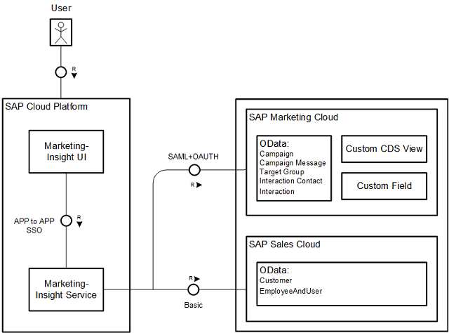

# Cloud Marketing Campaign Insights

## Overview

This sample app is a simple implementation for a sales manager, who collaborates with different marketers to view the [Campaigns](https://help.sap.com/viewer/b88f770e4b7c4ecead5477e7a6c7b8f7/latest/en-US/03f16d54b287e530e10000000a44538d.html) in [SAP Marketing Cloud](https://help.sap.com/viewer/b88f770e4b7c4ecead5477e7a6c7b8f7/latest/en-US/6dc5bf5434c58e21e10000000a44176d.html). These campaigns are either in planning stage or under execution. A sales manager can view only those campaigns for which sales manager is part of the Campaign Collaboration team.

This application provides the campaign details, like

*	The header fields.

* The members who are part of the assigned target group, with their employee responsible from [SAP Sales Cloud](https://help.sap.com/viewer/cea15f900ca04c4faa35d3044577fe27/latest/en-US/d2728ccb7818427fa3482eb593078162.html). This may be particularly useful in a B2B scenario.

* The collaboration team, with communication details.

* You’ll also be able to customize the campaign KPIs, using the concept of [Custom CDS Views](https://help.sap.com/viewer/b4367b1cec3243c4989f0ff3d727c4ab/7.51.6/en-US/1d77c396e7fc43bc94c46947305f5f71.html), where you will be able to define the KPIs based on the publicly available standard CDS views.

*  Also, the ability to use the [Custom Fields](https://help.sap.com/viewer/b4367b1cec3243c4989f0ff3d727c4ab/7.51.6/en-US/57909455bf7c4fdd8bcf48d76c1eae33.html) of the campaign object.

* Display the campaign content which is used in one or more actions with the executed campaign.

```
Note: The application can show up only the marketing content from an already executed campaigns.
```
You can freely adapt the UI and the service behind it to suit your business requirements.

This sample not only serves as the starting point for building the Sales Manager scenario, but also as a reference for you to build applications on [SAP Cloud Platform](https://help.sap.com/viewer/p/CP) either Neo or Cloud Foundry environments using the publicly available APIs of [SAP Marketing Cloud](https://help.sap.com/viewer/b88f770e4b7c4ecead5477e7a6c7b8f7/latest/en-US/6dc5bf5434c58e21e10000000a44176d.html) and [SAP Sales Cloud](https://help.sap.com/viewer/cea15f900ca04c4faa35d3044577fe27/latest/en-US/d2728ccb7818427fa3482eb593078162.html). 

## Block Diagram



## Download and Installation

Pre-requisite:
* You will need access to SAP Marketing Cloud, SAP Sales Cloud and SAP Cloud Platform account. These are SAP products and must to have to use this sample.
* Install [Node Package Manager](https://www.npmjs.com/get-npm).
* Install [Maven](https://maven.apache.org/download.cgi).

Complete the following steps to set up your application on SAP Cloud Platform (SCP):

* [Clone this Git repository to your system](https://help.github.com/articles/cloning-a-repository/).

* After cloning the latest code from the GitHub, build the “UI” and “Service” projects
  1. [Build Service](docs/build-service.md)
  2. [Build UI](docs/build-ui.md)

* Deploy the applications on SAP Cloud Platform
  1. [Deploy Service](docs/deploy-service.md)
  2. [Deploy UI](docs/deploy-ui.md)
  
* Perform the required Configurations to run the application
  1. [SAML Bearer Assertion Authentication](docs/saml-oauth-config.md)
  2. [Marketing Cloud Configuration](docs/mkt-cloud-configuration.md)
  3. [SAP Cloud Platform Configuration](docs/scp-configuration.md)

Finally, your deployed application should start working based on your configurations.
The `docs` folder contains end-to-end documentation.

##  Limitations
  1.  This initial version is designed for [SAP Cloud Platform Neo Environment](https://help.sap.com/viewer/65de2977205c403bbc107264b8eccf4b/Cloud/en-US/55d003a5e6964dfd92c75a13ee6b9c33.html).
  2. In this sample, only campaign of type "Default/Email" and "Newsletters" are considered.
  3. The campaign KPIs are only an indication, and the KPIs can be adapted as per the configuration steps.
  4. The marketing content tagged to campaigns is displayed only if the status of the campaign is "Released".

##  Known Issues

No known Issues.

##  How to obtain support

The sample app is provided "as-is", no support is provided.

##  To-Do
In the next versions, the following features are planned:
1. Support Open Source Project on SCP Cloud Foundry/[Kyma](https://github.com/kyma-project/kyma).
2. Improvements to the application.

## License
Copyright (c) 2018 SAP SE or an SAP affiliate company. All rights reserved. 

This file is licensed under the [SAP SAMPLE CODE LICENSE AGREEMENT](/LICENSE)
